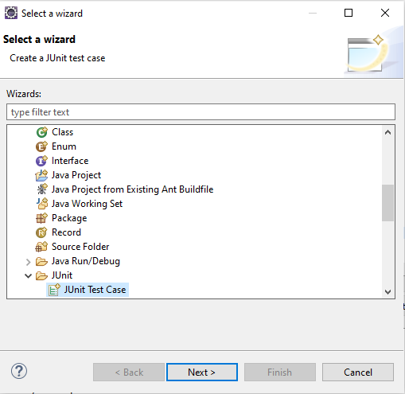
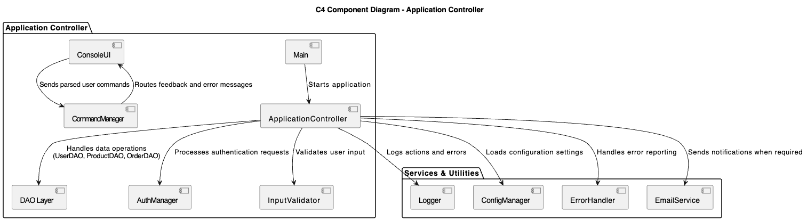

# ce204-hw-samet-anaz-java

# Overview

You will generate eclipse maven project with Junit4 from CLI and. Also you will generate jar and then you will run your application. For more information you can check examples [Maven – Maven in 5 Minutes](https://maven.apache.org/guides/getting-started/maven-in-five-minutes.html) and [TheNEXUS | A Community Project](https://books.sonatype.com/mvnref-book/reference/index.html)

## Releases

- [](https://github.com/SametAnaz/ce204-hw-samet-anaz-java.git/releases/latest)

## Platforms

- 

- 

- 

## Test Coverage

[](https://github.com/SametAnaz/ce204-hw-samet-anaz-java.git/actions/workflows/release.yml)

**Coverage**

- 

**Branch Coverage**

- 

**Line Coverage**

- 

**Method Coverage**

- 

### Install Requirements

- Eclipse
  
  - [Eclipse Downloads | The Eclipse Foundation](https://www.eclipse.org/downloads/)

- Maven
  
  - [Maven – Download Apache Maven](https://maven.apache.org/download.cgi)

- JDK
  
  - [Eclipse Downloads | The Eclipse Foundation](https://www.eclipse.org/downloads/)

- Lcov
  
  - https://fredgrott.medium.com/lcov-on-windows-7c58dda07080

- Coverxygen
  
  - [coverxygen · PyPI](https://pypi.org/project/coverxygen/)
  
  - [GitHub - psycofdj/coverxygen: Generate doxygen&#39;s documentation coverage report](https://github.com/psycofdj/coverxygen)

- Reportgenerator
  
  - https://reportgenerator.io/

```bash
dotnet tool install -g dotnet-reportgenerator-globaltool
```

- Choose Licence
  
  - [Appendix | Choose a License](https://choosealicense.com/appendix/)

#### Package Manager Windows Setup

We will install required application with package manager on Windows so use following script to install [chocolatey](https://chocolatey.org/install) and [scoop](https://scoop.sh/)

```batch
@echo off
@setlocal enableextensions
@cd /d "%~dp0"

echo Checking if Chocolatey is installed...
if exist "%ProgramData%\Chocolatey\bin\choco.exe" (
    echo Chocolatey is already installed.
) else (
    echo Installing Chocolatey...
    powershell -Command "Set-ExecutionPolicy Bypass -Scope Process -Force; iex ((New-Object System.Net.WebClient).DownloadString('https://chocolatey.org/install.ps1'))"
)

echo Checking if Scoop is installed...
where scoop >nul 2>&1
if %errorlevel%==0 (
    echo Scoop is already installed.
) else (
    echo Scoop is not installed. Installing Scoop...
    powershell Invoke-Expression (New-Object System.Net.WebClient).DownloadString('https://get.scoop.sh')
    powershell Set-ExecutionPolicy RemoteSigned -scope CurrentUser
)

pause
```

### Pre-Commit Code Formatter Astyle Installation

Before each commit also with batch script we will format our code with astyle we need to install it with package manager as following script you can visit package manager web site for more details [Chocolatey Software | Artistic Style 3.2.1](https://community.chocolatey.org/packages/astyle) and [https://astyle.sourceforge.net/](https://astyle.sourceforge.net/)

```batch
@echo off
@setlocal enableextensions
@cd /d "%~dp0"
echo Installing Astyle...
choco install astyle
```

Astyle tool need configuration there is example configuration named `astyle-options.txt`

```yaml
# https://github.com/brchiu/openairinterface5g/blob/master/ci-scripts/astyle-options.txt
# OAI is using a style that is similar to the Google style
--style=google
# long options can be written without the preceding '--'
# Convert tabs to spaces
convert-tabs
# Indentation is 2 spaces
indent=spaces=2
# Indent 'switch' blocks so that the 'case X:' statements are indented in the switch block. 
indent-switches
# Indent preprocessor blocks at bracket level 0.
indent-preproc-block
# Indent multi-line preprocessor #define statements.
indent-preproc-define
# Indent C++ comments beginning in column one.
indent-col1-comments
# Pad empty lines around header blocks
break-blocks
delete-empty-lines
# Attach a pointer or reference operator (*, &, or ^) to the variable name (right)
align-pointer=name
# The code line length is 200 characters/columns (this is the maximum allowed by astyle)
max-code-length=200
# If the line contains logical conditionals they will be placed first on the new line.
break-after-logical
# Force use of the linux end of line
# lineend=linux
```

After installation and config file generation we can format our code with following script this script look for .cs extension and format related files according to configuration in astyle-options.txt

```batch
@echo off
@setlocal enableextensions
@cd /d "%~dp0"

echo Formatting Code with Astyle...

astyle --options="astyle-options.txt" --recursive *.cs

pause
```

### Doxygen and Graphviz Setup + MkDocs Material Theme

We will use package manager for this but also we can use several tools I prefer to use following script to install all parties, This setup also use for mkdocs material them documentation generation maybe we can use for project website generation

```batch
@echo off
@setlocal enableextensions
@cd /d "%~dp0"

rem force re-install need "--force --force-dependencies -y" parameters

REM Test if Pandoc is installed
where pandoc >nul 2>&1
if %errorlevel%==0 (
    echo Pandoc is already installed.
) else (
    echo Installing Pandoc...
    choco install pandoc -y
)

REM Test if rsvg-convert is installed
where rsvg-convert >nul 2>&1
if %errorlevel%==0 (
    echo rsvg-convert is already installed.
) else (
    echo Installing rsvg-convert...
    choco install rsvg-convert -y
)

REM Test if Python is installed
where python >nul 2>&1
if %errorlevel%==0 (
    echo Python is already installed.
) else (
    echo Installing Python...
    choco install python -y
)


REM Test if Miktex is installed
where miktex >nul 2>&1
if %errorlevel%==0 (
    echo Miktex is already installed.
) else (
    echo Installing Miktex...
    choco install miktex -y
)

REM Test if CuRL is installed
where curl >nul 2>&1
if %errorlevel%==0 (
    echo curl is already installed.
) else (
    echo Installing CuRL...
    choco install curl -y
)

REM Test if MARP-CLI is installed
where marp >nul 2>&1
if %errorlevel%==0 (
    echo MARP-CLI is already installed.
) else (
    echo Installing MARP-CLI...
    choco install marp-cli -y
)

REM Test if Doxygen is installed
where doxygen >nul 2>&1
if %errorlevel%==0 (
    echo MARP-CLI is already installed.
) else (
    echo Installing Doxygen...
    choco install doxygen.install -y
)

REM Test if Doxygen is installed
where dot >nul 2>&1
if %errorlevel%==0 (
    echo Graphviz is already installed.
) else (
    echo Installing Graphviz...
    choco install graphviz -y
)

pip install mkdocs
pip install pymdown-extensions
pip install mkdocs-material
pip install mkdocs-material-extensions
pip install mkdocs-simple-hooks
pip install mkdocs-video
pip install mkdocs-minify-plugin
pip install mkdocs-git-revision-date-localized-plugin
pip install mkdocs-minify-plugin
pip install mkdocs-static-i18n
pip install mkdocs-with-pdf
pip install qrcode
pip install mkdocs-awesome-pages-plugin
pip install mkdocs-embed-external-markdown
pip install mkdocs-include-markdown-plugin
pip install mkdocs-ezlinks-plugin
pip install mkdocs-git-authors-plugin
pip install mkdocs-git-committers-plugin
pip install mkdocs-exclude

pip install pptx2md
pause
```

After doxygen installation create default doxygen file with -g option

```batch
doxygen -g
```

This will create Doxyfile for us to modify. Use Doxywizard to modify file. Be sure that your output directory should be **./docs** and all warnings should be opened and warnings stop operations.

# 

#### coverxygen Setup

We are parsing doxygen XML output with coverxygen and generate info file for LCOV. This tool generate output that LCOV use and generate HTML document coverage report

To install coverxygen you need python and pip

```bash
@echo off
@setlocal enableextensions
@cd /d "%~dp0"
echo Installing converxygen doxygen XML parser
pip install coverxygen
```

#### LCOV Setup

LCOV is use to generate HTML document coverage tool in this project, but it can be used for different purposes. You can use choco package manager to install application as follow

```bash
@echo off
@setlocal enableextensions
@cd /d "%~dp0"
echo Installing Report Generator...
choco install lcov -y
echo lcov and genhtml located on C:\ProgramData\chocolatey\lib\lcov\tools\bin\
pause
```

#### ReportGenerator Setup

We need to install [reportgenerator](https://reportgenerator.io/) for creation of HTML test reports, we will use choco to install visit package manager web site [Chocolatey Software | ReportGenerator (Portable) - Generates reports for various code coverage tools 5.1.20](https://community.chocolatey.org/packages/reportgenerator.portable)

```batch
@echo off
@setlocal enableextensions
@cd /d "%~dp0"
echo Installing Report Generator...
choco install reportgenerator.portable
```

## Repository Setup

#### Github Repositoy Creation

First create a empty project in github and clone it to your PC,

#### Pre-Commit Action Restrictions

Use following pre-commit script and replace it with `.git/hook/precommit`

```bash
#!/bin/bash
# Installation:
#   Copy this script as pre-commit to .git/hooks folder

OPTIONS="--options=astyle-options.txt"

# Check if .gitignore file exists
if [ ! -f astyle-options.txt ]; then
    echo "[!] astyle-options.txt file not found. Please make sure the astyle-options.txt file is present." >&2
    exit 1
fi

RETURN=0
ASTYLE=$(command -v astyle)
if [ $? -ne 0 ]; then
    echo "[!] AStyle is not installed. Unable to check source file format policy." >&2
    exit 1
fi

# Check if .gitignore file exists
if [ ! -f .gitignore ]; then
    echo "[!] .gitignore file not found. Please make sure the .gitignore file is present." >&2
    exit 1
fi

# Check if README.md file exists
if [ ! -f README.md ]; then
    echo "[!] README.md file not found. Please make sure the README.md file is present." >&2
    exit 1
fi

# Check if .gitignore file exists
if [ ! -f Doxyfile ]; then
    echo "[!] Doxyfile file not found. Please make sure the Doxyfile file is present." >&2
    exit 1
fi

FILES=$(git diff --cached --name-only --diff-filter=ACMRTUXB | grep -E "\.(cs|java|c|cpp|h)$")
for FILE in $FILES; do
    FORMATTED=$( "$ASTYLE" $OPTIONS < "$FILE" 2>&1 )
    if [ $? -ne 0 ]; then
        echo "[!] Error formatting $FILE:" >&2
        echo "$FORMATTED" >&2
        RETURN=1
    elif [ -n "$FORMATTED" ]; then
        echo "Formatted $FILE"
        echo "$FORMATTED"
        echo ""
        echo "$FORMATTED" > "$FILE"
        git add "$FILE"
    fi
done

if [ $RETURN -eq 1 ]; then
    echo "" >&2
    echo "Make sure you have run AStyle with the following options:" >&2
    echo $OPTIONS >&2
fi

exit $RETURN
```

This script will check astyle-options.txt file, gitignore file, README.md file and Doxyfile is exist if not it will be terminate your commit operation. Also after `astyle` installation and `astyle-options.txt` generation it will automatically format your source code before each commit. Formatting configuration will be stored in `astyle-options.txt` .

#### Create .gitignore with TOPTAL API via batch script

Use the following script to generate .gitignore file, you can change gitignore file by changing the configuration after `https://www.toptal.com/developers/gitignore/api`

This is the selected configuration

`c,csharp,vs,visualstudio,visualstudiocode,java,maven,c++,cmake,eclipse,netbeans`

```batch
@echo off

set API_URL=https://www.toptal.com/developers/gitignore/api/c,csharp,vs,visualstudio,visualstudiocode,java,maven,c++,cmake,eclipse,netbeans
set OUTPUT_FILE=.gitignore

REM Set the running folder to the current working folder
cd /d "%~dp0"

REM Download the API results using curl
curl -s -o %OUTPUT_FILE% %API_URL%

echo Downloaded .gitignore file from %API_URL% and saved as %OUTPUT_FILE%

pause
```

#### Create an Empty README.md file

Create and EMPTY `README.md` file and during project fill required parts

#### Create Default Doxyfile

Use following command to generate default `Doxyfile` if you didn't create or you can use pre-configured configuration and you can edit over this configurations. Be sure that your output directory should be **./docs** and all warnings should be opened and warnings stop operations.

```batch
doxygen -g
```

#### First commit is ready, You can commit and push your work.

You can use gitextension to commit your work, check if you get any error than return steps and check missing parts.

---

## Creating a Project

```bash
mvn archetype:generate -DgroupId=com.ucoruh.password -DartifactId=password-app -DarchetypeArtifactId=maven-archetype-quickstart -DarchetypeVersion=1.4 -DinteractiveMode=false
```

### Import Project to Eclipse

Use import existing maven project option to import project to Eclipse

### Rename Files

Rename App.java to PasswordApp.java and AppTest.java to PasswordAppTest.java and Generate Password.java and PasswordTest.java

```java
package com.ucoruh.password;

/**
 * Represents a stored password entry for a specific service.
 */
public class Password {
    private String service;
    private String username;
    private String password;

    /**
     * Constructs a Password object with service, username, and password.
     *
     * @param service the service name (e.g., Gmail, Facebook)
     * @param username the associated username
     * @param password the password string
     */
    public Password(String service, String username, String password) {
        this.service = service;
        this.username = username;
        this.password = password;
    }

    public String getService() {
        return service;
    }

    public String getUsername() {
        return username;
    }

    public String getPassword() {
        return password;
    }

    public void setUsername(String username) {
        this.username = username;
    }

    public void setPassword(String password) {
        this.password = password;
    }

    @Override
    public String toString() {
        return "Service: " + service + " | Username: " + username + " | Password: " + password;
    }
}

```

```java
package com.ucoruh.password;

import java.io.PrintStream;
import java.util.Scanner;

/**
 * Entry point for the Password Manager console application.
 */
public class PasswordApp {
    /**
     * Runs the application using the provided Scanner and PrintStream.
     * This method is designed for testing and production use.
     *
     * @param scanner Scanner for user input.
     * @param out PrintStream for output.
     */
    public static void runApp(Scanner scanner, PrintStream out) {
        AuthManager auth = AuthManager.getInstance();

        if (!auth.isMasterPasswordSet()) {
            out.print("Set master password: ");
            auth.createMasterPassword(scanner);
        }

        out.print("Enter master password to login: ");
        if (auth.login(scanner)) {
            PasswordManager pm = new PasswordManager(auth.getMasterPassword());
            int choice = -1;
            do {
                out.println("==== MAIN MENU ====");
                out.println("1. User Authentication");
                out.println("2. Secure Storage of Passwords");
                out.println("3. Password Generator");
                out.println("4. Auto-Login Feature");
                out.println("5. Multi-Platform Compatibility");
                out.println("0. Exit");
                out.print("Your choice: ");
                String input = scanner.nextLine();
                try {
                    choice = Integer.parseInt(input);
                } catch (NumberFormatException e) {
                    out.println("Invalid number.");
                    continue;
                }
                switch (choice) {
                    case 1:
                        auth.userMenu(scanner);
                        break;
                    case 2:
                        pm.menu(scanner, out);
                        break;
                    case 3:
                        PasswordGenerator.generate(scanner);
                        break;
                    case 4:
                        AutoLoginManager.menu(scanner);
                        break;
                    case 5:
                        PlatformManager.showPlatforms();
                        break;
                    case 0:
                        out.println("Exiting...");
                        break;
                    default:
                        out.println("Invalid choice.");
                        break;
                }
            } while (choice != 0);
        } else {
            out.println("Login failed.");
        }
    }

    /**
     * Main method to launch the console application.
     *
     * @param args command-line arguments (not used)
     */
    public static void main(String[] args) {
        Scanner scanner = new Scanner(System.in);
        runApp(scanner, System.out);
        scanner.close();
    }
}

```

Generate test with add new unit test feature in Eclipse 





```java
package com.ucoruh.password;

import static org.junit.Assert.*;

import org.junit.Test;

/**
 * Unit tests for the Password class.
 */
public class PasswordTest {

    @Test
    public void testConstructorAndGetters() {
        Password password = new Password("gmail", "user1", "pass123");
        assertEquals("gmail", password.getService());
        assertEquals("user1", password.getUsername());
        assertEquals("pass123", password.getPassword());
    }

    @Test
    public void testSetters() {
        Password password = new Password("service", "user", "pass");
        password.setUsername("newuser");
        password.setPassword("newpass");

        assertEquals("newuser", password.getUsername());
        assertEquals("newpass", password.getPassword());
    }

    @Test
    public void testToString() {
        Password password = new Password("github", "dev", "secure");
        String result = password.toString();
        assertTrue(result.contains("github"));
        assertTrue(result.contains("dev"));
        assertTrue(result.contains("secure"));
    }
}

```

```java
package com.ucoruh.password;

import static org.junit.Assert.assertFalse;
import static org.junit.Assert.assertTrue;

import java.io.ByteArrayInputStream;
import java.io.ByteArrayOutputStream;
import java.io.PrintStream;
import java.nio.charset.StandardCharsets;
import java.util.Scanner;

import org.junit.After;
import org.junit.Before;
import org.junit.Test;

/**
 * @brief Unit tests for the PasswordApp class using the runApp method.
 *
 * These tests simulate full application flow by injecting input and capturing output.
 * Additional tests cover each main menu branch.
 */
public class PasswordAppTest {

    private final PrintStream originalOut = System.out;
    private ByteArrayOutputStream outputStream;

    /**
     * Reset the AuthManager singleton and set up a new output stream.
     */
    @Before
    public void setUp() {
        AuthManager.resetInstance();
        outputStream = new ByteArrayOutputStream();
        System.setOut(new PrintStream(outputStream));
    }

    /**
     * Restore the original System.out after each test.
     */
    @After
    public void tearDown() {
        System.setOut(originalOut);
        outputStream.reset();
    }

    /**
     * @brief Tests a successful run of the application.
     *
     * Simulates setting a master password, successful login, and then exiting
     * the main menu. Verifies that the output contains the main menu prompt and
     * an exit message.
     */
    @Test
    public void testMainSuccess() {
        String simulatedInput = "testMaster\n" + "testMaster\n" + "0\n";
        ByteArrayInputStream inputStream = new ByteArrayInputStream(
                simulatedInput.getBytes(StandardCharsets.UTF_8));
        Scanner scanner = new Scanner(inputStream);

        PasswordApp.runApp(scanner, System.out);
        scanner.close();

        String output = outputStream.toString();
        assertTrue("Output should contain MAIN MENU", output.contains("==== MAIN MENU ===="));
        assertTrue("Output should contain Exiting...", output.contains("Exiting..."));
        assertFalse("Output should not contain 'Login failed.'", output.contains("Login failed."));
    }

    /**
     * @brief Tests the login failure scenario.
     *
     * Simulates setting a master password but then providing an incorrect
     * login input. Verifies that the output contains "Login failed."
     */
    @Test
    public void testMainError() {
        String simulatedInput = "testMaster\n" + "wrongMaster\n";
        ByteArrayInputStream inputStream = new ByteArrayInputStream(
                simulatedInput.getBytes(StandardCharsets.UTF_8));
        Scanner scanner = new Scanner(inputStream);

        PasswordApp.runApp(scanner, System.out);
        scanner.close();

        String output = outputStream.toString();
        assertTrue("Output should contain 'Login failed.'", output.contains("Login failed."));
    }

    /**
     * @brief Tests full menu navigation.
     *
     * Simulates a run of the application that displays the main menu.
     * Verifies that the captured output shows the menu header.
     */
    @Test
    public void testFullMenuNavigation() {
        String simulatedInput = "testMaster\n" + "testMaster\n" + "0\n";
        ByteArrayInputStream inputStream = new ByteArrayInputStream(
                simulatedInput.getBytes(StandardCharsets.UTF_8));
        Scanner scanner = new Scanner(inputStream);

        PasswordApp.runApp(scanner, System.out);
        scanner.close();

        String output = outputStream.toString();
        assertTrue("Output should contain MAIN MENU", output.contains("==== MAIN MENU ===="));
    }

    /**
     * @brief Tests main menu option 1: User Authentication.
     *
     * Simulates choosing option 1 and verifies that the user menu stub output is shown.
     */
    @Test
    public void testMenuOptionUserAuthentication() {
        // Simulated input: set master, login, then choose option 1, then exit.
        String simulatedInput = "testMaster\n" + "testMaster\n" + "1\n" + "0\n";
        ByteArrayInputStream inputStream = new ByteArrayInputStream(
                simulatedInput.getBytes(StandardCharsets.UTF_8));
        Scanner scanner = new Scanner(inputStream);

        PasswordApp.runApp(scanner, System.out);
        scanner.close();

        String output = outputStream.toString();
        assertTrue("Output should indicate user menu stub", output.contains("User menu functionality not yet implemented."));
    }

    /**
     * @brief Tests main menu option 2: Secure Storage of Passwords.
     *
     * Simulates choosing option 2 and then immediately exiting the inner PasswordManager menu.
     */
    @Test
    public void testMenuOptionSecureStorage() {
        // Simulated input: set master, login, choose option 2, then in inner menu choose 4 to exit, then exit main menu.
        String simulatedInput = "testMaster\n" + "testMaster\n" + "2\n" + "4\n" + "0\n";
        ByteArrayInputStream inputStream = new ByteArrayInputStream(
                simulatedInput.getBytes(StandardCharsets.UTF_8));
        Scanner scanner = new Scanner(inputStream);

        PasswordApp.runApp(scanner, System.out);
        scanner.close();

        String output = outputStream.toString();
        // Since PasswordManager.menu prints its own menu header, verify its presence.
        assertTrue("Output should contain inner PasswordManager menu", output.contains("==== MAIN MENU ===="));
    }

    /**
     * @brief Tests main menu option 3: Password Generator.
     *
     * Simulates choosing option 3 and entering a desired password length.
     * Verifies that the generated password output is present.
     */
    @Test
    public void testMenuOptionPasswordGenerator() {
        // Simulated input: set master, login, choose option 3, input desired length, then exit.
        String simulatedInput = "testMaster\n" + "testMaster\n" + "3\n" + "8\n" + "0\n";
        ByteArrayInputStream inputStream = new ByteArrayInputStream(
                simulatedInput.getBytes(StandardCharsets.UTF_8));
        Scanner scanner = new Scanner(inputStream);

        PasswordApp.runApp(scanner, System.out);
        scanner.close();

        String output = outputStream.toString();
        // Expect the password generator to output "Generated Password:".
        assertTrue("Output should contain Generated Password:", output.contains("Generated Password:"));
    }

    /**
     * @brief Tests main menu option 4: Auto-Login Feature.
     *
     * Simulates choosing option 4. Assumes AutoLoginManager.menu prints a placeholder message.
     */
    @Test
    public void testMenuOptionAutoLoginFeature() {
        // Simulated input: set master, login, choose option 4, then exit.
        String simulatedInput = "testMaster\n" + "testMaster\n" + "4\n" + "0\n";
        ByteArrayInputStream inputStream = new ByteArrayInputStream(
                simulatedInput.getBytes(StandardCharsets.UTF_8));
        Scanner scanner = new Scanner(inputStream);

        PasswordApp.runApp(scanner, System.out);
        scanner.close();

        String output = outputStream.toString();
        // Check for expected placeholder output; adjust expected text if needed.
        assertTrue("Output should mention Auto-Login Feature", output.contains("Auto-Login Feature"));
    }

    /**
     * @brief Tests main menu option 5: Multi-Platform Compatibility.
     *
     * Simulates choosing option 5. Assumes PlatformManager.showPlatforms prints a placeholder message.
     */
    @Test
    public void testMenuOptionMultiPlatform() {
        // Simulated input: set master, login, choose option 5, then exit.
        String simulatedInput = "testMaster\n" + "testMaster\n" + "5\n" + "0\n";
        ByteArrayInputStream inputStream = new ByteArrayInputStream(
                simulatedInput.getBytes(StandardCharsets.UTF_8));
        Scanner scanner = new Scanner(inputStream);

        PasswordApp.runApp(scanner, System.out);
        scanner.close();

        String output = outputStream.toString();
        // Check for expected placeholder text from platform manager; adjust as necessary.
        assertTrue("Output should mention Supported platforms", output.contains("Supported platforms:"));
    }
}

```

### Update pom.xml

```xml
<?xml version="1.0" encoding="UTF-8"?>

<project xmlns="http://maven.apache.org/POM/4.0.0"
    xmlns:xsi="http://www.w3.org/2001/XMLSchema-instance"
    xsi:schemaLocation="http://maven.apache.org/POM/4.0.0 http://maven.apache.org/xsd/maven-4.0.0.xsd">
    <modelVersion>4.0.0</modelVersion>
    <!-- The Basics -->
    <groupId>com.ucoruh.password</groupId>
    <artifactId>password-app</artifactId>
    <version>1.0-SNAPSHOT</version>
    <packaging>jar</packaging>

    <!-- More Project Information -->
    <name>password-app</name>
    <url>https://github.com/SametAnaz/ce204-hw-samet-anaz-java.git</url>
    <scm>
        <url>https://github.com/SametAnaz/ce204-hw-samet-anaz-java.git</url>
    </scm>
    <inceptionYear>2023</inceptionYear>
    <developers>
        <developer>
            <name>Samet Anaz</name>
            <organization>RTEU</organization>
            <email>samet_anaz21@ergon.edu.tr</email>
            <roles>
                <role>Developer</role>
                <role>Designer</role>
            </roles>
        </developer>
        <developer>
            <name>Other Person</name>
            <organization>RTEU</organization>
            <email>mail@gmail.com</email>
            <roles>
                <role>Developer</role>
            </roles>
        </developer>
    </developers>
    <contributors>
        <contributor>
            <name>Samet Anaz</name>
            <email>samet_anaz21@ergon.edu.tr</email>
            <organization>RTEU</organization>
            <roles>
                <role>Developer</role>
                <role>Designer</role>
            </roles>
        </contributor>

    </contributors>
    <description>ce204-hw-samet-anaz-java</description>
    <organization>
        <name>Recep Tayyip Erdogan University</name>
        <url>www.erdogan.edu.tr</url>
    </organization>
    <!-- Environment Settings -->
    <issueManagement>
        <system>Github</system>
        <url>https://github.com/SametAnaz/ce204-hw-samet-anaz-java.git</url>
    </issueManagement>
    <ciManagement>
        <system>Github</system>
        <notifiers>
            <notifier>
                <address>samet_anaz21@ergon.edu.tr</address>
                <sendOnSuccess>true</sendOnSuccess>
                <sendOnError>true</sendOnError>
                <sendOnFailure>true</sendOnFailure>
                <sendOnWarning>true</sendOnWarning>
            </notifier>
        </notifiers>
        <url>https://github.com/SametAnaz/ce204-hw-samet-anaz-java.git</url>
    </ciManagement>
    <repositories>
        <repository>
            <id>ce204-hw-samet-anaz-java</id>
            <name>ce204-hw-samet-anaz-java</name>
            <url>https://github.com/SametAnaz/ce204-hw-samet-anaz-java.git</url>
        </repository>
    </repositories>
    <distributionManagement>
        <site>
            <name>https://github.com/SametAnaz/ce204-hw-samet-anaz-java.git</name>
            <id>ce204-hw-samet-anaz-java</id>
        </site>
        <downloadUrl>https://github.com/SametAnaz/ce204-hw-samet-anaz-java.git</downloadUrl>
        <repository>
            <id>ce204-hw-samet-anaz-java</id>
            <name>ce204-hw-samet-anaz-java</name>
            <url>https://github.com/SametAnaz/ce204-hw-samet-anaz-java.git</url>
        </repository>
    </distributionManagement>
    <properties>
        <project.build.sourceEncoding>UTF-8</project.build.sourceEncoding>
        <maven.compiler.source>17</maven.compiler.source>
        <maven.compiler.target>17</maven.compiler.target>
    </properties>

    <dependencies>
        <dependency>
            <groupId>junit</groupId>
            <artifactId>junit</artifactId>
            <version>4.11</version>
            <scope>test</scope>
        </dependency>
        <dependency>
            <groupId>org.hamcrest</groupId>
            <artifactId>hamcrest-all</artifactId>
            <version>1.3</version>
            <scope>test</scope>
        </dependency>
        <!-- SLF4J API -->
        <dependency>
            <groupId>org.slf4j</groupId>
            <artifactId>slf4j-api</artifactId>
            <version>1.7.32</version>
        </dependency>
        <!-- Logback Implementation -->
        <dependency>
            <groupId>ch.qos.logback</groupId>
            <artifactId>logback-classic</artifactId>
            <version>1.2.6</version>
        </dependency>
    </dependencies>

    <build>
        <plugins>
            <plugin>
                <groupId>org.apache.maven.plugins</groupId>
                <artifactId>maven-compiler-plugin</artifactId>
                <configuration>
                    <source>17</source>
                    <target>17</target>
                </configuration>
            </plugin>
            <plugin>
                <groupId>org.apache.maven.plugins</groupId>
                <artifactId>maven-surefire-plugin</artifactId>
                <configuration>
                    <includes>
                        <include>**/PasswordAppTest.java</include>
                        <include>**/PasswordTest.java</include>
                    </includes>
                </configuration>
            </plugin>
            <plugin>
                <groupId>org.jacoco</groupId>
                <artifactId>jacoco-maven-plugin</artifactId>
                <version>0.8.7</version>
                <executions>
                    <execution>
                        <goals>
                            <goal>prepare-agent</goal>
                        </goals>
                    </execution>
                    <execution>
                        <id>report</id>
                        <phase>test</phase>
                        <goals>
                            <goal>report</goal>
                        </goals>
                    </execution>
                </executions>
            </plugin>
            <plugin>
                <groupId>org.apache.maven.plugins</groupId>
                <artifactId>maven-site-plugin</artifactId>
                <version>4.0.0-M8</version>
                <configuration>
                    <port>9000</port>
                    <tempWebappDirectory>${basedir}/target/site</tempWebappDirectory>
                </configuration>
            </plugin>
            <!-- Maven Shade Plugin -->
            <plugin>
                <groupId>org.apache.maven.plugins</groupId>
                <artifactId>maven-shade-plugin</artifactId>
                <version>3.2.4</version>
                <executions>
                    <execution>
                        <phase>package</phase>
                        <goals>
                            <goal>shade</goal>
                        </goals>
                        <configuration>
                            <createDependencyReducedPom>false</createDependencyReducedPom>
                            <transformers>
                                <transformer
                                    implementation="org.apache.maven.plugins.shade.resource.ManifestResourceTransformer">
                                    <mainClass>
                                        com.ucoruh.password.PasswordApp</mainClass>
                                </transformer>
                            </transformers>
                        </configuration>
                    </execution>
                </executions>
            </plugin>
        </plugins>

        <pluginManagement><!-- lock down plugins versions to avoid using Maven
            defaults (may be moved to parent pom) -->
            <plugins>
                <!-- clean lifecycle, see
                https://maven.apache.org/ref/current/maven-core/lifecycles.html#clean_Lifecycle -->
                <plugin>
                    <artifactId>maven-clean-plugin</artifactId>
                    <version>3.1.0</version>
                </plugin>
                <!-- default lifecycle, jar packaging: see
                https://maven.apache.org/ref/current/maven-core/default-bindings.html#Plugin_bindings_for_jar_packaging -->
                <plugin>
                    <artifactId>maven-resources-plugin</artifactId>
                    <version>3.0.2</version>
                </plugin>
                <plugin>
                    <artifactId>maven-compiler-plugin</artifactId>
                    <version>3.8.0</version>
                </plugin>
                <plugin>
                    <artifactId>maven-surefire-plugin</artifactId>
                    <version>2.22.1</version>
                </plugin>
                <plugin>
                    <artifactId>maven-jar-plugin</artifactId>
                    <version>3.0.2</version>
                </plugin>
                <plugin>
                    <artifactId>maven-install-plugin</artifactId>
                    <version>2.5.2</version>
                </plugin>
                <plugin>
                    <artifactId>maven-deploy-plugin</artifactId>
                    <version>2.8.2</version>
                </plugin>
                <!-- site lifecycle, see
                https://maven.apache.org/ref/current/maven-core/lifecycles.html#site_Lifecycle -->
                <plugin>
                    <artifactId>maven-site-plugin</artifactId>
                    <version>3.7.1</version>
                </plugin>
                <plugin>
                    <artifactId>maven-project-info-reports-plugin</artifactId>
                    <version>3.0.0</version>
                </plugin>
            </plugins>
        </pluginManagement>
    </build>
</project>
```

### Generate Project Site Files

- site.xml
  
  - resources
    
    - images
      
      - banner.png
      
      - logo.png
    
    - markdown
      
      - overview.md

You can use files in project

### Build the Project

Enter pom.xml root folder and run following command to test and generate jar file

```bash
mvn clean test site package
```

### Run Project

You can run application by specify the Main function

```bash
java -cp password-app-1.0-SNAPSHOT.jar com.ucoruh.password.PasswordApp
```

Output

```bash
C:\Users\ugur.coruh\Desktop\ce204-hw-samet-anaz-java\password-app\target>java -cp password-app-1.0-SNAPSHOT.jar com.ucoruh.password.PasswordApp
Hello World!
```

### Generate HTML Coverage Report

```bash
reportgenerator "-reports:target/site/jacoco/jacoco.xml" "-sourcedirs:src/main/java" "-targetdir:coveragereport" -reporttypes:Html
```

Output

```bash
C:\Users\ugur.coruh\Desktop\ce204-hw-samet-anaz-java\password-app>reportgenerator "-reports:target/site/jacoco/jacoco.xml" "-sourcedirs:src/main/java" "-targetdir:coveragereport" -reporttypes:Html
2023-05-24T17:26:40: Arguments
2023-05-24T17:26:40:  -reports:target/site/jacoco/jacoco.xml
2023-05-24T17:26:40:  -sourcedirs:src/main/java
2023-05-24T17:26:40:  -targetdir:coveragereport
2023-05-24T17:26:40:  -reporttypes:Html
2023-05-24T17:26:40: Writing report file 'coveragereport\index.html'
2023-05-24T17:26:40: Report generation took 0,2 seconds

C:\Users\ugur.coruh\Desktop\ce204-hw-samet-anaz-java\password-app>
```


## Run Maven Site

```bash
mvn site:run
```

Use CTRL+C to cancel from console





This has code coverage and documentation coverage reports also


### Clone-Test-Generate WebSite-Package-Generate Report-Run Web Site

```bash
@echo off

echo Enable necessary extensions
@setlocal enableextensions

echo Change the current working directory to the script directory
@cd /d "%~dp0"

git clone https://github.com/SametAnaz/ce204-hw-samet-anaz-java.git.git

echo Get the current directory
set "currentDir=%CD%"

echo Change directory to password-app
cd password-app

echo Perform Maven clean, test, site generation, and packaging
call mvn clean test site package

echo Return to the previous directory
cd ..

echo Generate Doxygen HTML and XML Documentation
call doxygen Doxyfile

echo Change directory to password-app
cd password-app

echo Generate ReportGenerator HTML Report
call reportgenerator "-reports:target/site/jacoco/jacoco.xml" "-sourcedirs:src/main/java" "-targetdir:target/site/coveragereport" -reporttypes:Html

echo Display information about the binary file
echo Our Binary is a Single Jar With Dependencies. You Do Not Need to Compress It.

echo Return to the previous directory
cd ..

echo Generate Doxygen Coverage Report

echo Create coverxygen directory
cd password-app
cd target
cd site
mkdir coverxygen
cd ..
cd ..
cd ..

echo Run Coverxygen
call python -m coverxygen --xml-dir ./password-app/target/site/doxygen/xml --src-dir ./ --format lcov --output ./password-app/target/site/coverxygen/lcov.info --prefix %currentDir%\password-app\

echo Run lcov genhtml
call perl C:\ProgramData\chocolatey\lib\lcov\tools\bin\genhtml ./password-app\target\site\coverxygen\lcov.info -o password-app/target/site/coverxygen

echo Package Coverage Report-1
call tar -czvf test-jacoco-report.tar.gz -C password-app/target/site/jacoco .

echo Package Coverage Report-2
call tar -czvf test-coverage-report.tar.gz -C password-app/target/site/coveragereport .

echo Package Code Documentation
call tar -czvf application-documentation.tar.gz -C password-app/target/site/doxygen .

echo Package Product Site
call tar -czvf application-site.tar.gz -C target/site .

echo Return to the previous directory
cd ..

echo Operation Completed!
pause
```

### Run Web Site

```bash
@echo off
@setlocal enableextensions
@cd /d "%~dp0"

cd password-app

echo Run Web Site
echo to Exit Use CTRL+Z CTRL+C
start http://localhost:9000/
mvn site:run

echo Operation Completed!
pause
```

### Run Jar File

```bash
@echo off
@setlocal enableextensions
@cd /d "%~dp0"

echo Running Application
java -jar password-app/target/password-app-1.0-SNAPSHOT.jar

echo Operation Completed!
pause
```

