# Password Manager Application

[](https://github.com/SametAnaz/ce204-hw-samet-anaz-java/releases/latest)
[](https://github.com/SametAnaz/ce204-hw-samet-anaz-java/actions)
[](LICENSE)
[](https://www.oracle.com/java/technologies/javase/jdk17-archive-downloads.html)
[](https://maven.apache.org/)

## 📋 Table of Contents

- [Overview](#-overview)
- [Features](#-features)
- [System Requirements](#-system-requirements)
- [Installation](#-installation)
- [Usage](#-usage)
- [Architecture](#-architecture)
  - [Core Components](#core-components)
  - [Storage Systems](#storage-systems)
  - [Security Features](#security-features)
  - [UML Diagrams](#uml-diagrams)
  - [GUI Components](#gui-components)
  - [Test Components](#test-components)
- [Development](#-development)
- [Testing](#-testing)
- [Documentation](#-documentation)
- [Contributing](#-contributing)
- [License](#-license)

## 🔍 Overview

The Password Manager Application is a robust, secure, and user-friendly password management solution developed using Java and the Maven framework. It provides comprehensive password management capabilities with a focus on security, usability, and extensibility.

## ✨ Features

- 🔐 Secure password storage with master password protection
- 🎲 Advanced password generation with customizable options
- 👁️ Intuitive password viewing and management
- 📋 Clipboard integration for easy password copying
- 🔄 Auto-login functionality
- 🌐 Cross-platform compatibility
- 🎨 Modern, user-friendly GUI interface
- 🔒 Multiple storage options (File-based and SQLite database)
- 🛡️ Strong encryption for all sensitive data
- 📱 Platform-specific credential management

## 💻 System Requirements

- Java 17 or higher
- Maven 3.8.1 or higher
- SQLite support
- Minimum 2GB RAM
- 100MB free disk space

## 🚀 Installation

1. Clone the repository:
```bash
git clone https://github.com/SametAnaz/ce204-hw-samet-anaz-java.git
```

2. Navigate to the project directory:
```bash
cd ce204-hw-samet-anaz-java
```

3. Build the project:
```bash
mvn clean install
```

4. Run the application:
```bash
java -jar target/password-app-1.0-SNAPSHOT.jar
```

## 🎯 Usage

The application provides both GUI and command-line interfaces. After launching, you'll need to:

1. Set up a master password (first-time use)
2. Log in using your master password
3. Access various features through the main menu:
   - Password Management
   - Password Generation
   - Auto-Login Configuration
   - Platform Settings

### GUI Interface

The graphical interface provides easy access to all features:

- **Main Window**: Central dashboard for all password management operations
- **Add Password**: Create new password entries with service and username
- **View Passwords**: List and search all stored passwords
- **Update Password**: Modify existing password entries
- **Generate Password**: Create strong, customized passwords
- **Delete Password**: Remove unwanted password entries

### Command-Line Interface

For users who prefer terminal-based operations:

```bash
# View all passwords
1. Select option 2 (Secure Storage of Passwords)
2. Select option 1 (View Passwords)

# Add new password
1. Select option 2 (Secure Storage of Passwords)
2. Select option 2 (Add Password)

# Generate password
1. Select option 3 (Password Generator)
2. Enter desired length
```

## 🏗️ Architecture

### Core Components

#### Authentication System
- `AuthManager`: Singleton class managing user authentication
- Master password creation and verification
- Secure password hashing using `EncryptionUtil`

#### Password Management
- `PasswordManager`: Core class handling password operations
- Credential storage and retrieval
- Integration with storage systems

#### Storage Systems
- `InterfacePasswordStorage`: Abstract storage interface
- `FilePasswordStorage`: File-based implementation
- `DatabasePasswordStorage`: SQLite database implementation
- `PasswordStorageFactory`: Factory pattern for storage creation

#### Security Features
- Strong encryption for all stored passwords
- Secure master password handling
- Memory-safe data management
- Clipboard security measures

### UML Diagrams

#### Core System Diagrams
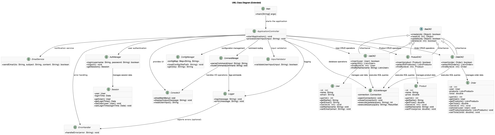
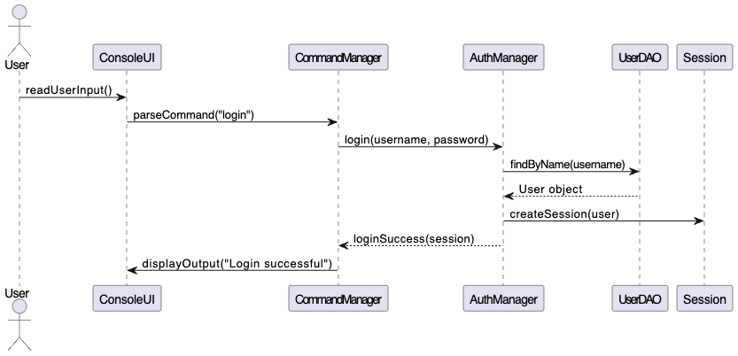
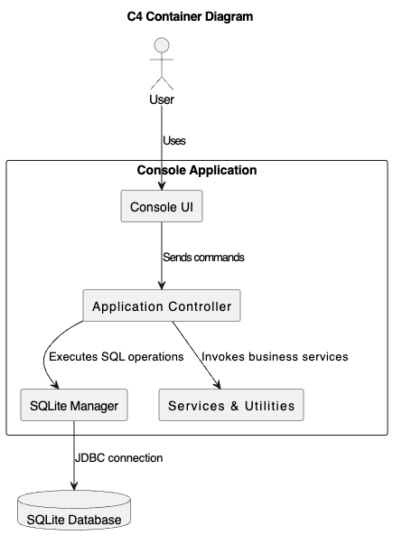

#### Architectural Views
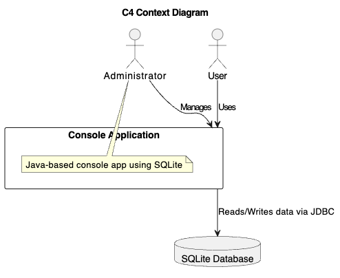
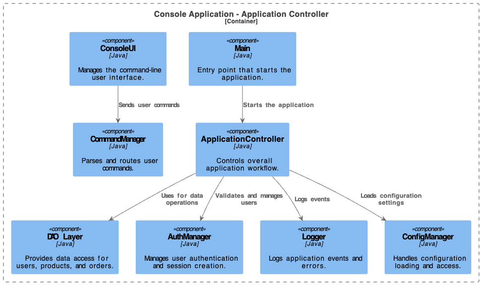
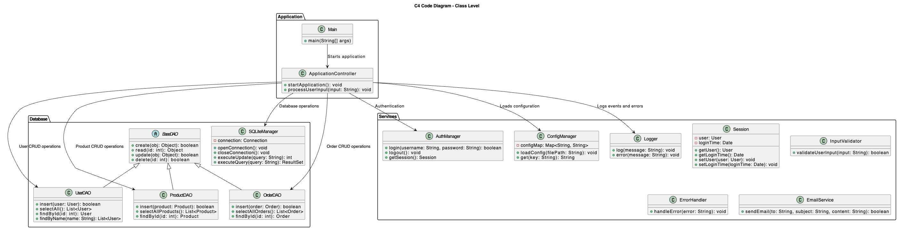
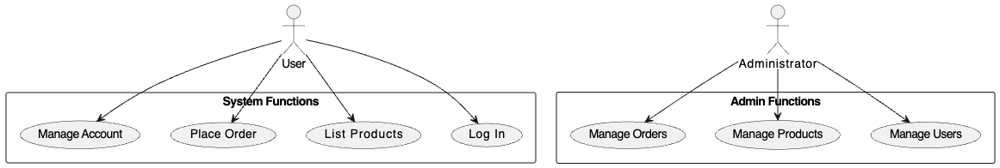

### GUI Components

#### Password Management Interface
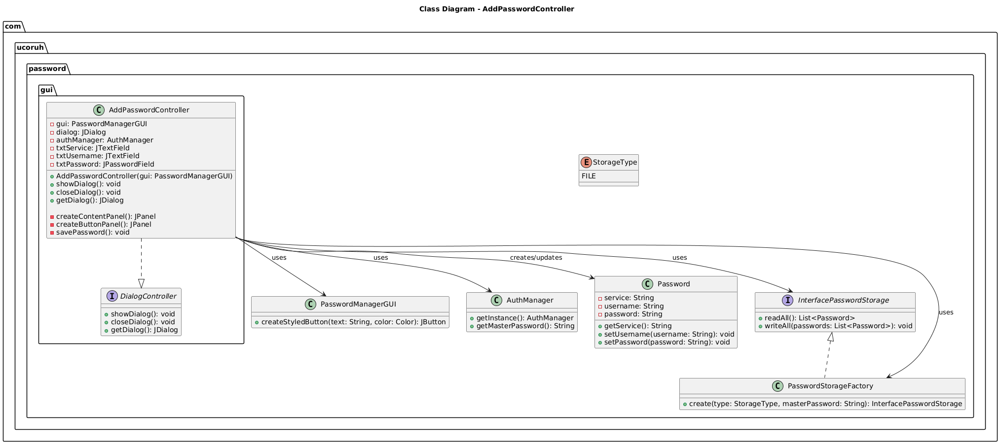
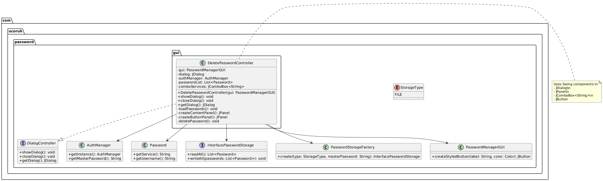
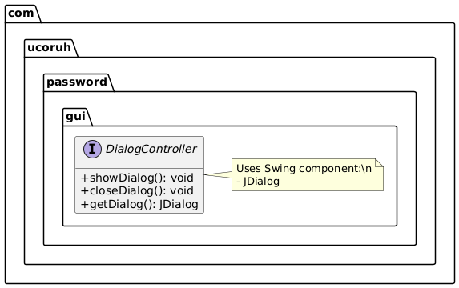

#### Password Generation Interface
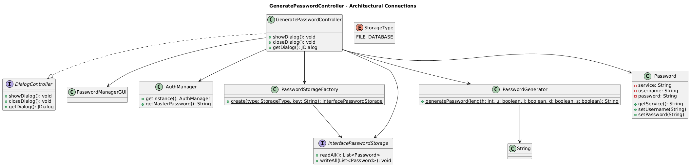
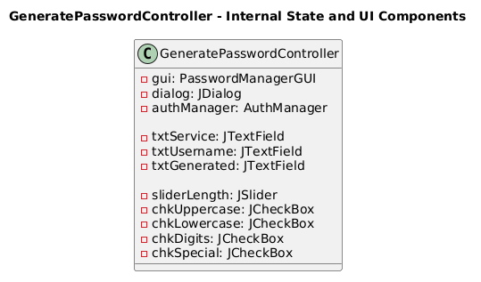
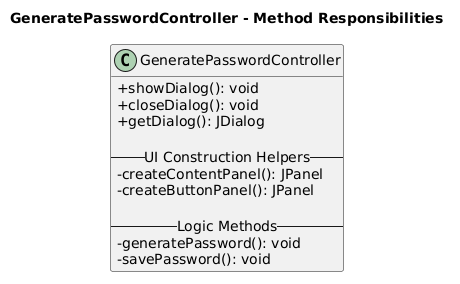

#### Main GUI Components
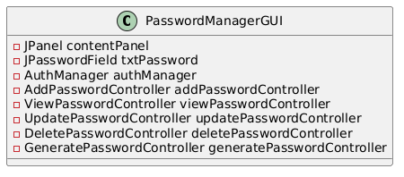
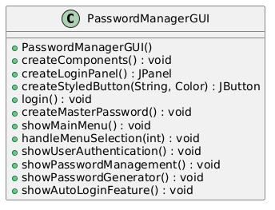
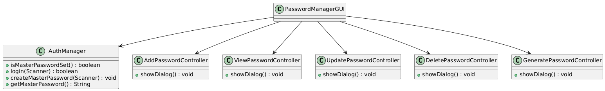

#### Password Operations Interface
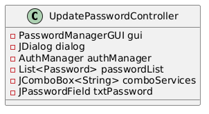
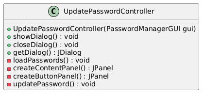
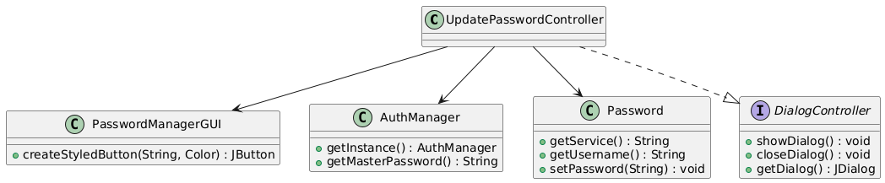
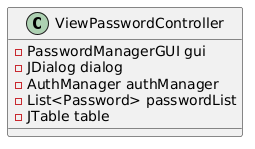
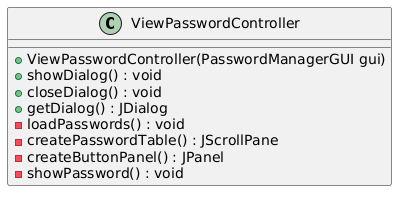
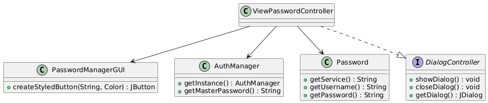

### Test Components

#### Authentication Testing
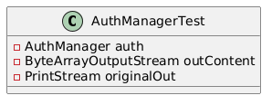
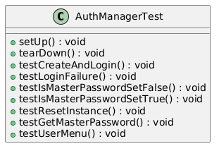
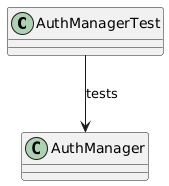

#### Feature Testing
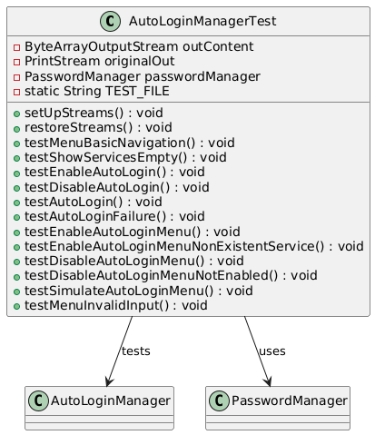
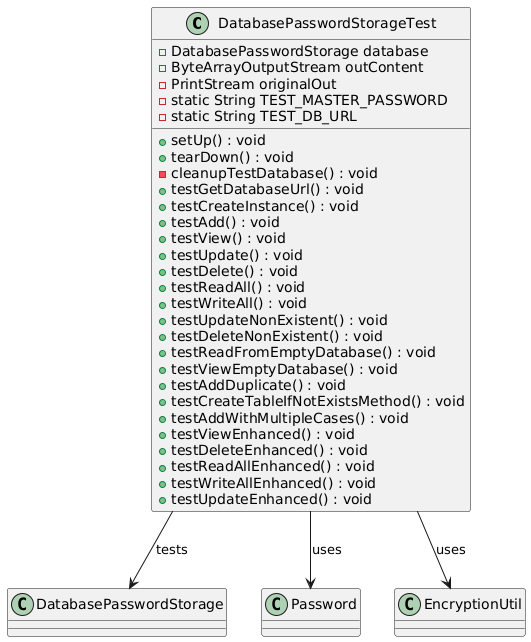
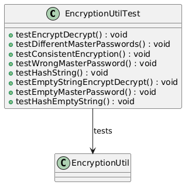
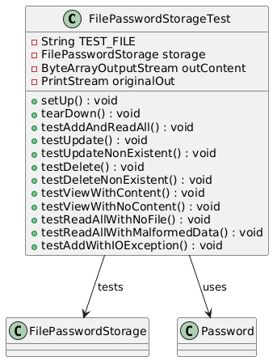
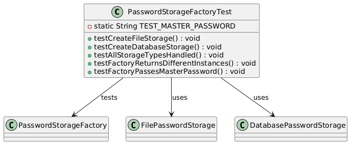

## 👨‍💻 Development

The project follows standard Java development practices and uses Maven for dependency management. Key components include:

### Core Classes

```java
// Password Class - Represents a stored password entry
public class Password {
    private String service;    // Service name (e.g., Gmail, Facebook)
    private String username;   // Associated username
    private String password;   // Encrypted password
    // ... methods for access and modification
}

// PasswordManager Class - Manages password operations
public class PasswordManager {
    private final Map<String, String> credentials;
    private final String masterPassword;
    private final InterfacePasswordStorage storage;
    
    // ... methods for password management
}

// AuthManager Class - Handles authentication
public class AuthManager {
    private static AuthManager instance;
    private String masterPassword;
    
    // ... authentication methods
}
```

### Storage Implementation

```java
// File-based Storage
public class FilePasswordStorage implements InterfacePasswordStorage {
    private static final String FILE = "passwords.txt";
    private final String masterPassword;
    
    // ... file operations
}

// Database Storage
public class DatabasePasswordStorage implements InterfacePasswordStorage {
    private static final String DB_URL = "jdbc:sqlite:passwords.db";
    private final String masterPassword;
    
    // ... database operations
}
```

## 🧪 Testing

The project includes comprehensive unit tests and integration tests:

### Unit Tests
- Authentication testing
- Password management testing
- Storage system testing
- Encryption testing
- GUI component testing

### Integration Tests
- End-to-end workflow testing
- Storage system integration
- GUI integration testing

Run tests using:
```bash
mvn test
```

Test coverage reports are generated in the `target/site/jacoco` directory.

## 📚 Documentation

- [Java Installation Guide](Java_Installation_Guide_Windows.md)
- [Maven Installation Guide](Maven_Installation_Guide_Windows.md)
- [API Documentation](target/site/apidocs/index.html)
- [Test Reports](target/site/surefire-report.html)

### Additional Resources
- JavaDoc documentation for all classes
- UML diagrams for architecture visualization
- Test coverage reports
- User guides and tutorials

## 🤝 Contributing

1. Fork the repository
2. Create your feature branch (`git checkout -b feature/AmazingFeature`)
3. Commit your changes (`git commit -m 'Add some AmazingFeature'`)
4. Push to the branch (`git push origin feature/AmazingFeature`)
5. Open a Pull Request

### Development Guidelines
- Follow Java coding standards
- Document all public APIs
- Update UML diagrams for architectural changes

## 📄 License

This project is licensed under the MIT License - see the [LICENSE](LICENSE) file for details.

---

Built with ❤️ by [Samet Anaz](https://github.com/SametAnaz)

